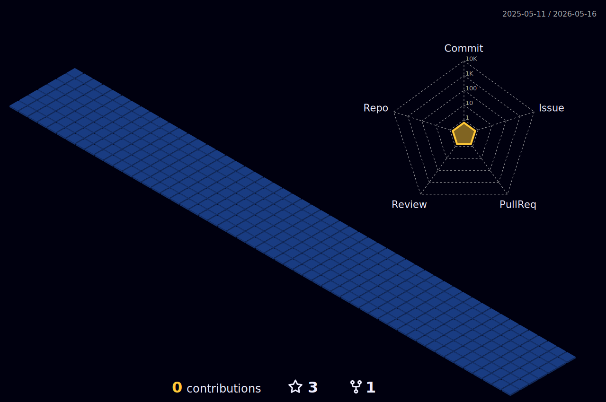

 

### :man_technologist: Hey there, I'm Hardik! 👋

Thapar Institute of Engineering and Technology COE '24

👀 Research Interests: Deep Learning

 
<h2>Social Networks</h2>

[![Twitter][1.2]][1] [![LinkedIn][2.2]][2] [![Instagram][3.2]][3] [![Telegram][4.2]][4] [![Discord][5.2]][5]

[1.2]: https://s4.uupload.ir/files/twitter_prkb.png
[2.2]: https://s4.uupload.ir/files/linkedin_amwn.png
[3.2]: https://s4.uupload.ir/files/instagram_6djz.png
[4.2]: https://s4.uupload.ir/files/telegram_q47u.png
[5.2]: https://skillicons.dev/icons?i=discord

[1]: https://twitter.com/DhanjalHardik
[2]: https://www.linkedin.com/in/hardikdhanjal/
[3]: https://www.instagram.com/hardik.treats
[4]: http://telegram.me/hardikdhanjal
[5]: https://discordapp.com/users/369170695260733451

 
<h2>Skills</h2>

  

  

  
<b>:gear: &nbsp;Git statistics</b>

  
  
 
 
 
 

